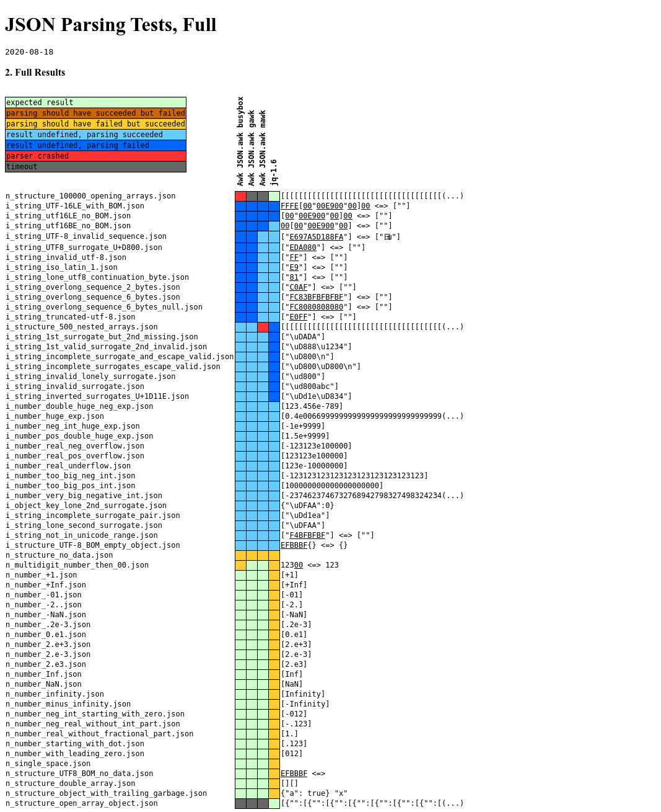

# Test results comparing three JSON.awk variants and JQ

[Test methodology](http://seriot.ch/parsing_json.php)

[Test suite](https://github.com/nst/JSONTestSuite)

Fully green rows ("works as expected") are not shown.

The timeout for each test is 5 seconds.  On my machine increasing the timeout
to 8 seconds allows all tests to finish.

Busybox awk does not support the NUL character U+0000.

"Result undefined" refers to the JSON specification. So "result undefined,
parsing succeeded" (failed) means that in the absence of a clear expectation,
the implementation succeeded or failed at parsing the input JSON text.

[HTML source](parsing.html)

[Pruned source](parsing_pruned.html)

